# 🥒 PicklePolls

A Django-based polling application built with Python.


---
Made with 💚 by Edchel Stephen Nini


📩 edchelstephens@gmail.com
💼 https://www.linkedin.com/in/edchelstephens/
👋 https://www.facebook.com/edchelstephens/

---

## ✨ Features

* 📊 Create and manage polls
* ❓ Add questions and choices options
* 🗳️ Vote on polls
* 📈 View poll results
* 🐍 Django-powered backend
* 🧪 Automated testing with pytest
* 🌐 Selenium-based functional tests
* 🚀 CI/CD with GitHub Actions
* 🕵️ Observability with Grafana, Prometheus for Metrics, Loki fo Logs and Tempo for Tracing. 


## 📸 Screenshots
## 📱 App
#### 🏠 Home
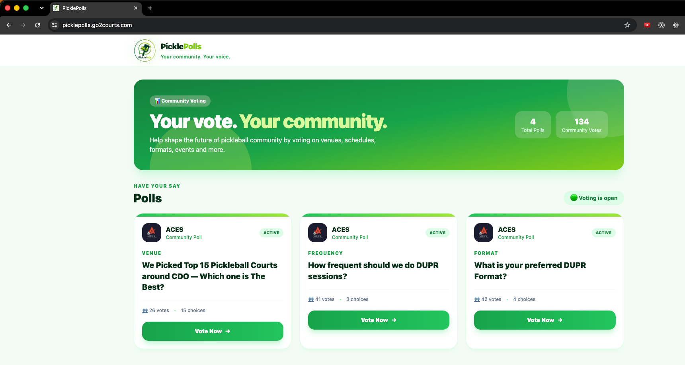

#### 👨‍💻 Home with Developer Credit
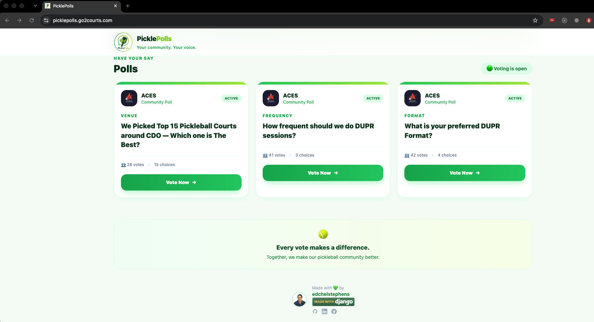

#### 🗳️ Poll Detail
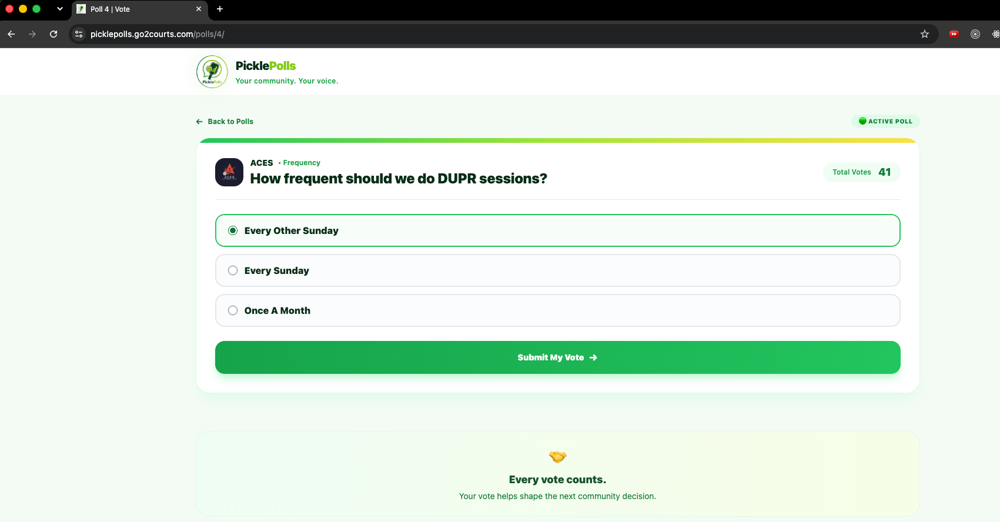

#### 📊 Poll Results
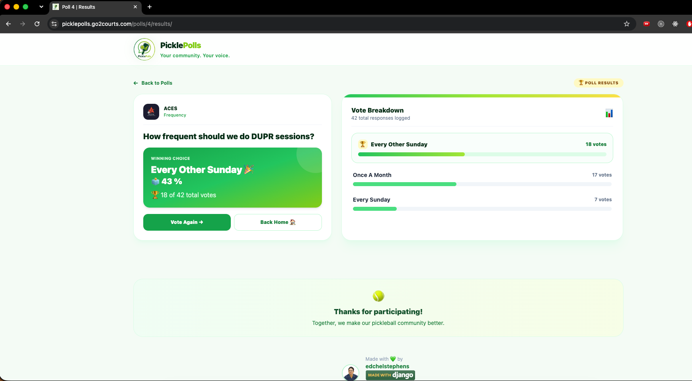


## 🧪 Unit Tests

#### 🧪 Unit Tests
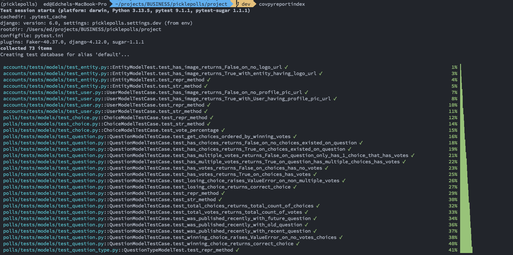

#### ✅ Full Unit Test Suite
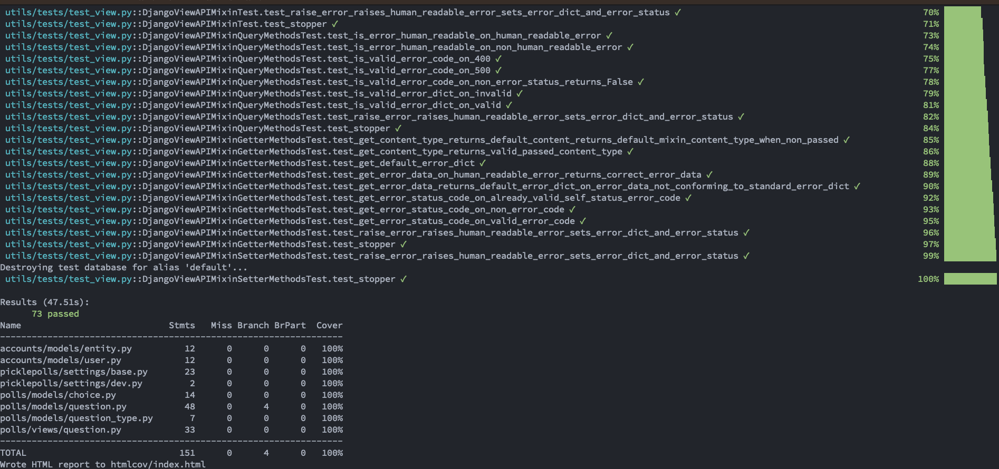

#### 📊 Code Coverage
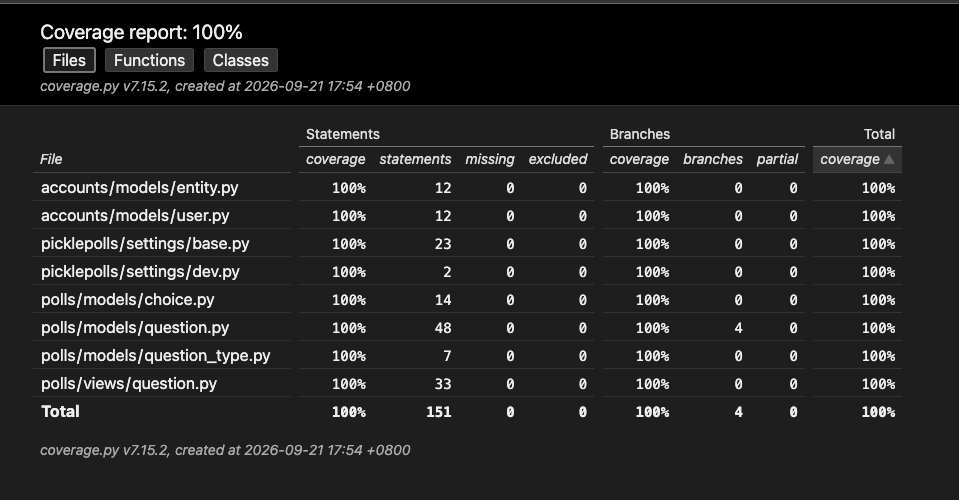

#### 🌐 Automated Browser Test with Selenium
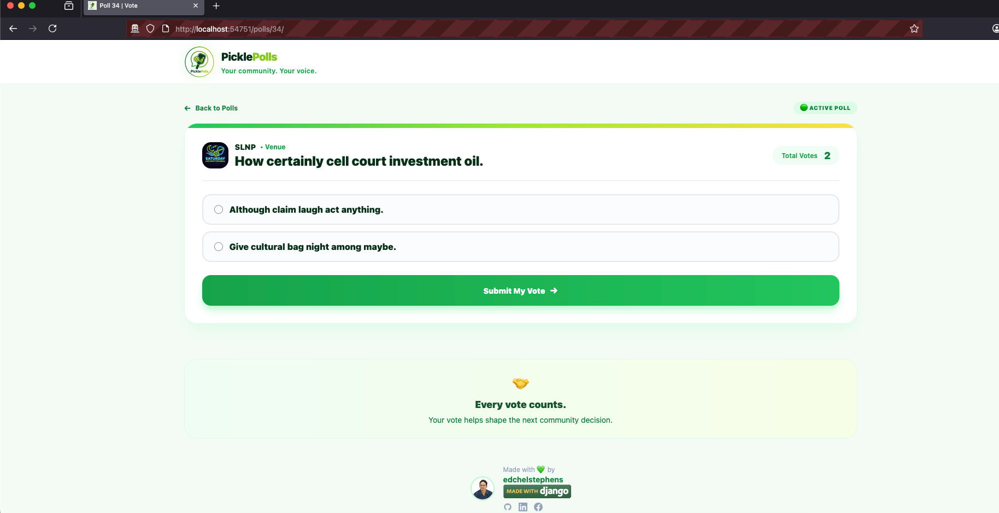


## ⚙️ CI/CD

#### 🔀 Pull Request — Automated Tests
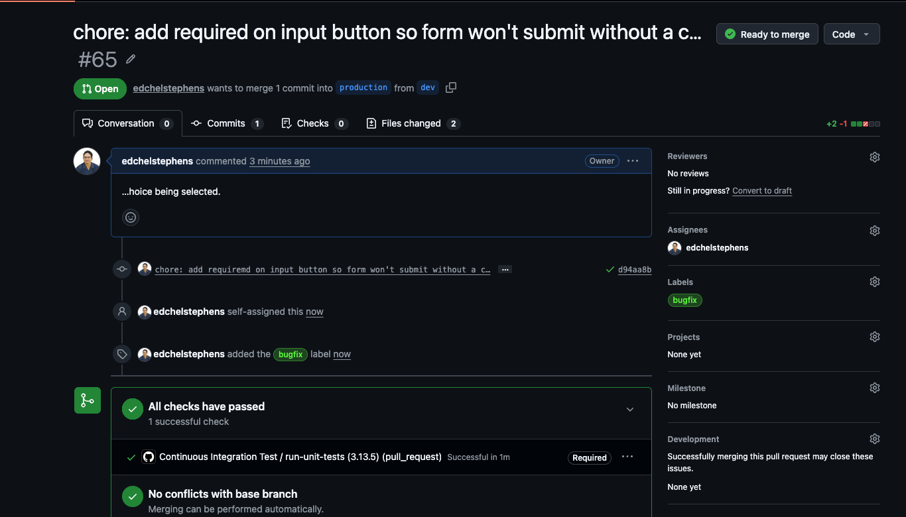

#### 🧪 GitHub Actions — Full Test Run
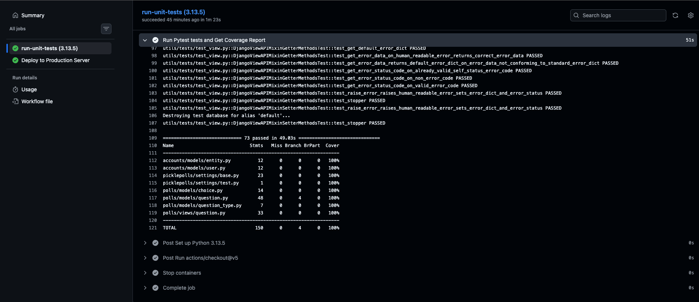

#### 🚀 Automated Deployment
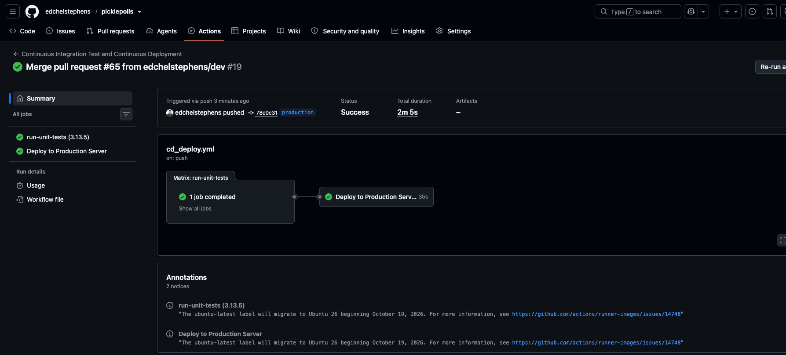

#### 🚀 GitHub Actions — Deployment Run
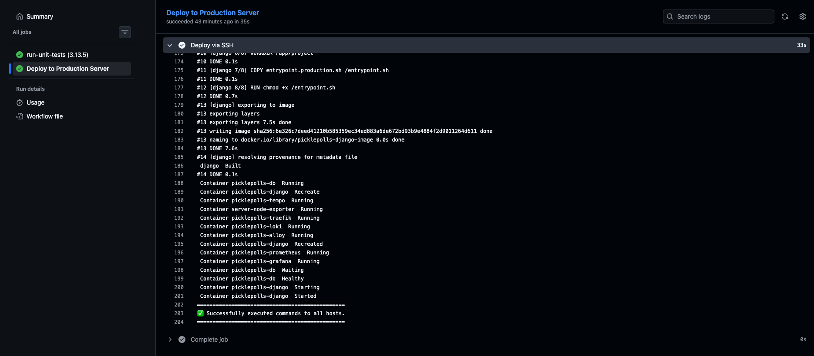


## 👀🖥️📊 Observability & Monitoring

#### 📊 Grafana Django Dashboard
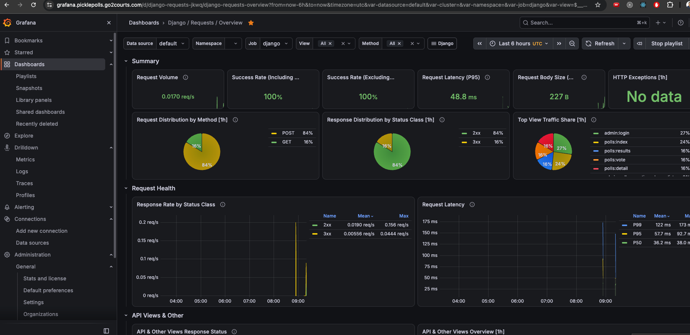

#### 🖥️ Grafana Node Exporter — Server Metrics
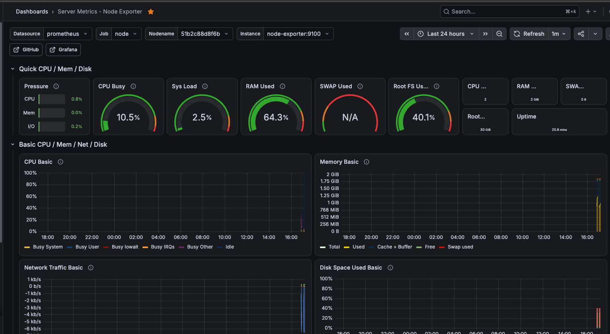

#### 📝 Grafana Logs with Loki
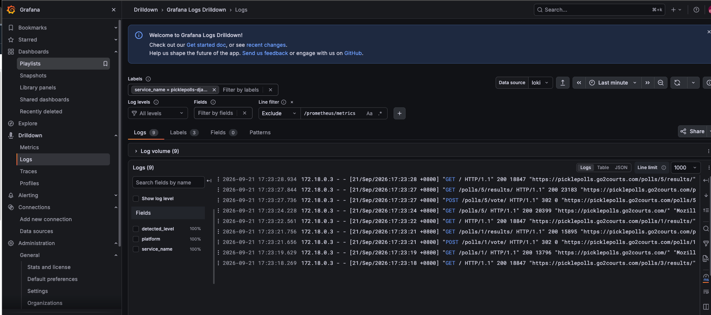

#### 🔭 Grafana Traces with Tempo
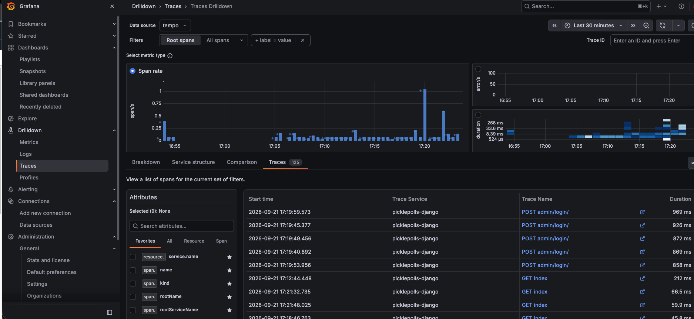

#### 🔍 Full Request Cycle Trace
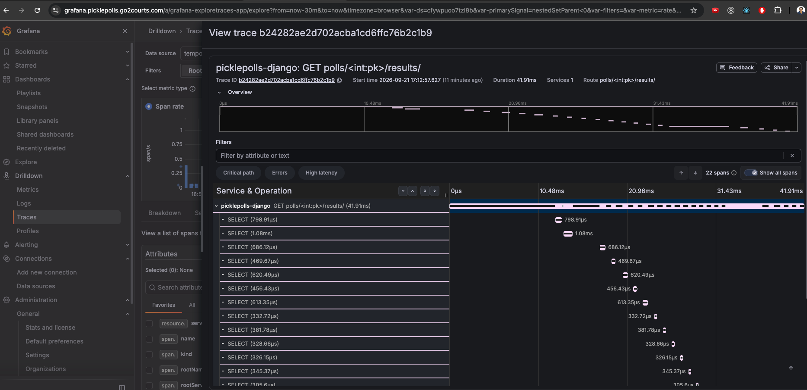
---

## 🛠️ Tech Stack

* 🐍 Python
* ⚙️ Django
* 🐘 PostgreSQL
* 🌐 Django Rest Framework
* 🎨 HTML / CSS , Tailwind CSS
* ⚡ JavaScript
* 🐳 Docker
* 🧪 pytest
* 🌐 Selenium
* 🚀 GitHub Actions

---

# 🚀 Getting Started

## 1. 📥 Clone the repository

```bash
git clone <repository-url>
cd PicklePolls
```

## 2. 🐍 Create a virtual environment

```bash
python -m venv .venv
```

Activate it:

### 🍎 macOS / 🐧 Linux

```bash
source .venv/bin/activate
```

### 🪟 Windows

```bash
.venv\Scripts\activate
```

## 3. 📦 Install dependencies

```bash
pip install -r _requirements/dev.txt
```

## 4. 🗄️ Run migrations

```bash
python manage.py migrate
```

## 5. ▶️ Start the development server

```bash
python manage.py runserver
```

Open:

```text
http://127.0.0.1:8000/
```

---

# 🐳 Running with Docker

## 💻 Locally

1. Install Docker.

2. Build the Docker image locally:

```bash
docker image build -t picklepolls .
```

3. Spawn a container of the image:

```bash
docker run --env-file .env -it --rm -p 8080:8000 picklepolls
```

4. Visit the app at:

```text
http://127.0.0.1:8080/
```

---

# 🐳 Running with Docker Compose

1. Build the containers and run:

```bash
sudo docker compose -f local.yml up --build
```

Or run in daemon mode:

```bash
sudo docker compose -f local.yml up --build -d
```

---

# 🚀 Deployment

## 🐳 With Docker

1. Install Docker.

2. Build the production image:

```bash
docker image build -f Dockerfile.prod -t picklepolls .
```

3. Spawn a container of the image in daemon mode:

```bash
docker run --env-file .env -it --rm -d -p 8080:8000 picklepolls
```

4. Update nginx config to listen to:

```text
proxy_pass http://127.0.0.1:8020
```

---

## 🐳 With Docker Compose

### 1. 📦 Install Docker Compose

Install docker-compose if not yet available, then check the version:

```bash
sudo apt update
sudo apt install docker-compose-v2

sudo docker compose version
```

### 2. 🚀 Build and run the production Docker Compose file

```bash
sudo docker compose -f production.yml up --build -d
```

---

# 🗄️ PostgreSQL with Docker Compose

## 💻 Local

Run the database first:

```bash
sudo docker compose -f local.yml up db
```

## 🚀 Production Initialization

Make sure:

```text
POSTGRES_USER=postgres
POSTGRES_PASSWORD=postgres
```

Then start the database:

```bash
sudo docker compose -f production.yml up db
```

### 🐚 Execute Bash on the Container

```bash
sudo docker exec -it <container_id> bash
```

### 🐘 Run psql

```bash
psql -U postgres
```

### 👤 Create the Database and User

Create the database and the user, then grant privileges:

```sql
CREATE USER <user_name>;

ALTER USER <user_name> WITH PASSWORD '<password>';

CREATE DATABASE <db_name>;

GRANT ALL PRIVILEGES ON DATABASE <db_name> TO <user_name>;

\c <db_name>;

GRANT ALL ON SCHEMA public TO <user_name>;
```

---

# 🧪 Testing

## 📊 Run Tests with Coverage


To run tests locally (not from docker container) and spawn mozilla browser with selenium from machine.
First alter the POSTGRES_HOST=localhost in the .env file


Run the test suite with pytest:


```bash
coverage run -m pytest -sv
coverage report
```

## 🌐 Run Full Coverage Report and Open in Chrome

```bash
coverage run -m pytest -sv && coverage report && coverage html && open -a 'Google Chrome' htmlcov/index.html
```

---

# 👨‍💻 Development

The project uses Django's standard development workflow.

After making model changes, create and apply migrations:

```bash
python manage.py makemigrations
python manage.py migrate

```

---

# 🕵️ Observability

1. With docker compose setup, When adding Data Sources in Grafana for Promethues, the url should be:
    http://prometheus:9090 

2. With docker compose setup, When adding Data Sources in Grafana for Loki, the url should be:
    http://loki:3100 


3. With docker compose setup, When adding Data Sources in Grafana for Tempo, the url should be:
    http://tempo:3200 


4. Grafana import dashboards
Django dashboards
⭐ 20693 — Django / django-prometheus
⭐ 17616 — Django / Requests / Overview
⭐ 1860 — Node Exporter Full (Ubuntu Server Metrics)

# Docker Logs

## Make sure docker has max size for logs so it won't grow indefinitely 

1. Check the current Docker logging driver

SSH into your EC2 server and run:

docker info --format '{{.LoggingDriver}}'

If you're currently using Docker's default, you'll probably see:

json-file
2. Check your current Docker configuration

Run:

sudo cat /etc/docker/daemon.json

If the file doesn't exist:

ls -l /etc/docker/daemon.json

Your existing configuration may contain other settings, so don't overwrite it blindly.

3. Edit /etc/docker/daemon.json
sudo nano /etc/docker/daemon.json

Add:

{
  "log-driver": "local",
  "log-opts": {
    "max-size": "50m",
    "max-file": "5"
  }
}


# 🤖 CI/CD

The project includes GitHub Actions for automated testing and deployment.

The CI pipeline:

* 🧪 Runs the test suite automatically to help ensure changes do not introduce regressions.
* 🚀 Automatically deploys on merge to the production branch.

---

# 📄 License

This project is for educational and development purposes.
